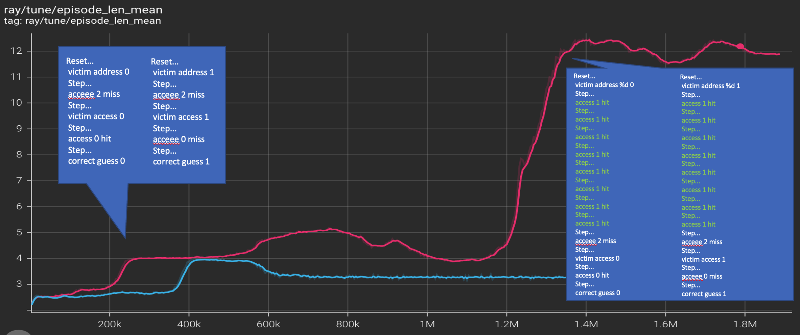
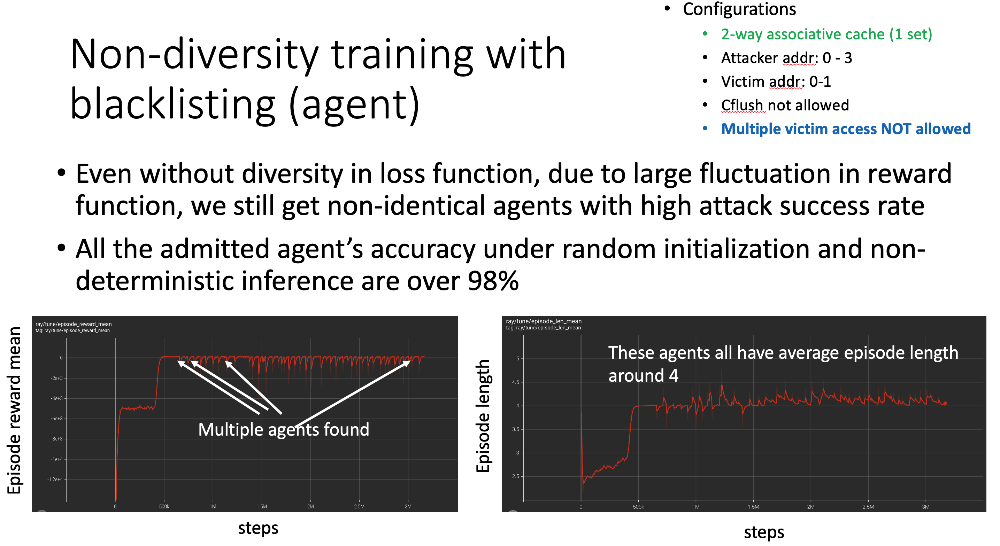

# attack pattern extraction from agent checkpoint

To extract patterns from a checkpoint of an agent, use the following command
```
$ python replay_checkpoint.py <path_to_the_checkpoint>
```
For example
```
$ python replay_checkpoint.py /home/mulong/ray_results/PPO_cache_guessing_game_env_fix_2022-02-07_10-22-51nrjmmih_/checkpoint_004006/checkpoint-4006
```
note the example checkpoint file is from a specific configuration stored in ```~/ray_results/PPO_cache_guessing_game_env_fix_2022-02-07_10-22-51nrjmmih_/env.config``` binary pickle file, which is automatically loaded by the python script. The current configuration is victim_addr 0-3, attacker_addr 0-7, 4-set direct-map cache.

will out put the attack seqeunce on screen.  
```
 Reset... 
 victim address %d 0 
 Step... 
 acceee 2 miss 
 Step... 
 victim access 0 
 Step... 
 access 0 hit 
 Step... 
 correct guess 0 
```

It will generate `temp.txt` file under current directory, which includes entries of attack patterns. For example (each row is a trajectory and each number is an action label)

```
249 5 5 38 120 98 67 98 3 196 20  
249 5 5 38 120 98 67 98 3 85  
249 5 5 38 120 98 67 18  
249 5 5 38 120 98 19  
 ...
```
To parse the action labels, use ```parse_action()``` function in ```cache_guessing_game_env_impl.py```
See https://github.com/lmlaaron/CacheSimulator/blob/e959a63cb09eec8728e30413112097efc741a481/src/replay_checkpoint.py#L120 for example.

And `victim.txt` with same number of rows which correspond to the trajectories above.
```
0
1
2
3
...
```

To extract all patterns from the all checkpoints use the following command

```
$ rm temp.txt
$ tm victim.txt
$  ./extract_pattern.sh <path_to_directory_of_the_log>
```
For example

```
$  ./extract_pattern.sh /home/mulong/ray_results/PPO_cache_guessing_game_env_fix_2022-02-07_10-22-51nrjmmih_/
```


The classification task can be performed based on these traces. Currently, we distinguish whether two models/agents/policies are the same model/agent/policy by checking the pattterns generated by the agents for each possible secret, if there is one pattern different then we see these two models/agents/policies as different, see `is_same_agent()` in `test_custom_policy_diversity_works.py`. A more principled classifier integrating experts knowledge on types of side channel attacks would greatly help the diversity-driven agent to be more efficient in discoverying different attacks. 

`/home/mulong/ray_results/PPO_cache_guessing_game_env_fix_2022-02-01_10-16-10exoo_y_h` path corresponds to checkpoints of the following  with patterns in `pattern-exoo_y_h.txt`.

`/home/mulong/ray_results/PPO_cache_guessing_game_env_fix_2022-01-30_20-11-17ixofdheb` path corresponds to checkpoints of the following  with patterns in `pattern-ixofdheb.txt`.
