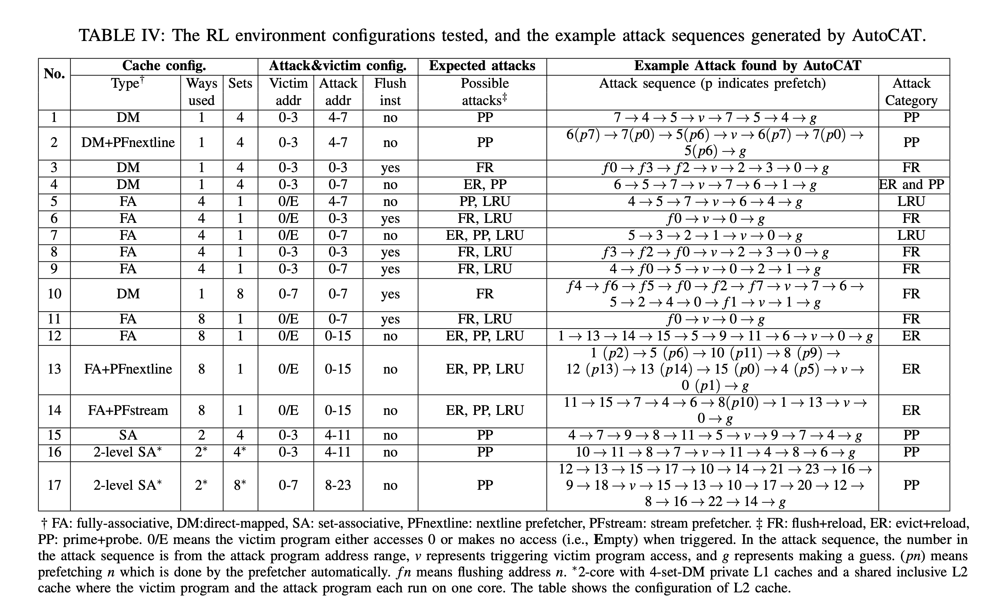

# Finding attack patterns under different configs (Table IV)

We reproduce the attack patterns found in Table IV, as shown below.



First, go to the directory.

```
cd ${GIT_ROOT}/src/rlmeta
```

(Optional) To train a config in Table IV, use the following script:

```
$ python train_ppo_attack.py env_config=<NAME_OF_THE_CONFIG>
```

which will print out the following:

```
/home/ml2558/miniconda3/envs/rllib/lib/python3.9/site-packages/hydra/_internal/defaults_list.py:251: UserWarning: In 'ppo_attack': Defaults list is missing `_self_`. See https://hydra.cc/docs/upgrades/1.0_to_1.1/default_composition_order for more information
 warnings.warn(msg, UserWarning)
workding_dir = /home/ml2558/Downloads/AutoCAT/src/rlmeta/outputs/2022-10-31/19-06-02
...
```
Please take notes of the ```working_dir```, which is the place where all the checkpoint and logs corresponding to this training is saved.

There are 17 configs in Table 4, and we have ```hpca_ae_exp_4_1```, ```hpca_ae_exp_4_2```, ..., ```hpca_ae_exp_4_17``` correpondingly, replace ```<NAME_OF_THE_CONFIG>``` with these. All config files are located in ```src/rlmeta/config/env_config```.

Use ```Ctrl+C``` to interrupt the training, which will save a checkpoint in the given path.

To extract the attack pattern from the checkpoint, use the following command (replace ```<NAME_OF_THE_CONFIG>``` and ```<ABSOLUTE_PATH_TO_CHECKPOINT>```) correspondingly. The ```<ABSOLUTE_PATH_TO_CHECKPOINT>``` is under ```wordking_dir``` printed out when training.

```
$ python sample_attack.py  env_config=<NAME_OF_THE_CONFIG> checkpoint=<ABSOLUTE_PATH_TO_CHECKPOINT>
```

Since the training takes some time, we provide pretrained checkpoints in the following directory ```src/rlmeta/data/table4```. Use the above command to replay these checkpoints.

For example

```
$ python sample_attack.py  env_config=hpca_ae_exp_4_1 checkpoint=${GIT_ROOT}/src/rlmeta/data/table4/hpca_ae_exp_4_1/ppoagent.pth
```

will print out the following:

```
/home/ml2558/miniconda3/envs/rllib/lib/python3.9/site-packages/hydra/_internal/defaults_list.py:251: UserWarning: In 'sample_attack': Defaults list is missing `_self_`. See https://hydra.cc/docs/upgrades/1.0_to_1.1/default_composition_order for more information
  warnings.warn(msg, UserWarning)
 {'architecture': {'word_size': 1, 'block_size': 1, 'write_back': True}, 'cache_1': {'blocks': 4, 'associativity': 1, 'hit_time': 1, 'rep_policy': 'lru'}, 'mem': {'hit_time': 1000}} 
 Initializing... 
 Reset...(also the cache state) 
 victim address (hex) 0x0 
 Step... 
 access (hex) 7 hit 
 Step... 
 access (hex) 4 miss 
 Step... 
 access (hex) 5 miss 
 Step... 
 victim access (hex) 0  
 Step... 
 access (hex) 7 hit 
 Step... 
 access (hex) 5 hit 
 Step... 
 access (hex) 4 miss 
 Step... 
 correct guess (hex) 0 
 Reset...(also the cache state) 
 victim address (hex) 0x1 
 Step... 
 access (hex) 7 miss 
 Step... 
 access (hex) 4 hit 
 Step... 
 access (hex) 5 miss 
 Step... 
 victim access (hex) 1  
 Step... 
 access (hex) 7 hit 
 Step... 
 access (hex) 5 miss 
 Step... 
 correct guess (hex) 1 
 Reset...(also the cache state) 
 victim address (hex) 0x2 
 Step... 
 access (hex) 7 miss 
 Step... 
 access (hex) 4 hit 
 Step... 
 access (hex) 5 miss 
 Step... 
 victim access (hex) 2  
 Step... 
 access (hex) 7 hit 
 Step... 
 access (hex) 5 hit 
 Step... 
 access (hex) 4 hit 
 Step... 
 correct guess (hex) 2 
 Reset...(also the cache state) 
 victim address (hex) 0x3 
 Step... 
 access (hex) 7 miss 
 Step... 
 access (hex) 4 miss 
 Step... 
 access (hex) 5 miss 
 Step... 
 victim access (hex) 3  
 Step... 
 access (hex) 7 miss 
 Step... 
 correct guess (hex) 3 
[2022-10-30 10:53:51,395][root][INFO] - 

  info             key        mean         std         min         max    count
------  --------------  ----------  ----------  ----------  ----------  -------
sample  episode_length  7.25000000  0.82915620  6.00000000  8.00000000        4
sample  episode_return  0.93750000  0.00829156  0.93000000  0.95000000        4
sample    correct_rate  1.00000000  0.00000000  1.00000000  1.00000000        4


  info             key        mean         std         min         max    count
------  --------------  ----------  ----------  ----------  ----------  -------
sample  episode_length  7.25000000  0.82915620  6.00000000  8.00000000        4
sample  episode_return  0.93750000  0.00829156  0.93000000  0.95000000        4
sample    correct_rate  1.00000000  0.00000000  1.00000000  1.00000000        4
```

In the Config 1, the victim has four possible secret values ```0, 1, 2, 3```, for each of the possible secret value, we replay the RL agent deterministically, and print out the corresponding traces in ```sample_attack.py```, for example, when secret value is ```0``` or ```0x0``` in hexdecimal, the corresponding traces is

```
Reset...(also the cache state) 
 victim address (hex) 0x0 
 Step... 
 access (hex) 7 hit 
 Step... 
 access (hex) 4 miss 
 Step... 
 access (hex) 5 miss 
 Step... 
 victim access (hex) 0  
 Step... 
 access (hex) 7 hit 
 Step... 
 access (hex) 5 hit 
 Step... 
 access (hex) 4 miss 
 Step... 
 correct guess (hex) 0 
```

i.e., the attacker will have the  attack pattern  is ```7 --> 4 --> 5 --> v --> 7 --> 5 --> 4 --> g``` as shown in Table 4 in the paper. For the case when the secret is ```1,2,3```, the corresponding attack pattern is ```7-->4-->5-->v --> 7-->5-->g```, ```7-->4-->5-->v --> 7-->5-->4-->g```  and ```7-->4-->5-->v-->7-->g```. Some of the patterns make a guess earlier, this is because they can infer the secret based on the previous accesses. Among these patterns correpsonding to the secret values, we select the longest patterns to put in Table 4 in the paper.

Using the given checkpoints  in ```src/rlmeta/data/table4/```, you can reporduce the rest attack sequences found in Table IV. (for config 12, use seed =9)

