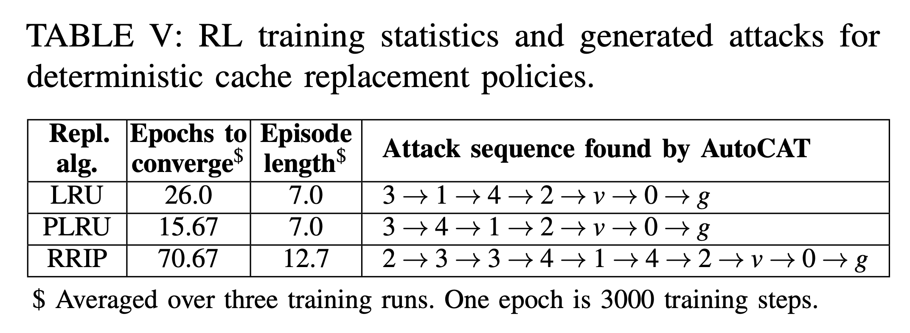

# Compare efforts of training with different replacement policies


We compare the attack patterns found in Table V and epochs need for different replacement policies.




First, go to the directory.

```
cd ${GIT_ROOT}/src/rlmeta
```

(Optional) To train a config in Table V, use the following script:

```
$ python train_ppo_attack.py env_config=<NAME_OF_THE_CONFIG> 
```

which will print out the following:

```
/home/ml2558/miniconda3/envs/rllib/lib/python3.9/site-packages/hydra/_internal/defaults_list.py:251: UserWarning: In 'ppo_attack': Defaults list is missing `_self_`. See https://hydra.cc/docs/upgrades/1.0_to_1.1/default_composition_order for more information
 warnings.warn(msg, UserWarning)
workding_dir = /home/ml2558/Downloads/AutoCAT/src/rlmeta/outputs/2022-10-31/19-06-02
...
```
Please take notes of the ```working_dir```, which is the place where all the checkpoint and logs corresponding to this training is saved.

There are 3 configs in Table V, and we have ```hpca_ae_exp_5_lru```, ```hpca_ae_exp_5_plru```, ..., ```hpca_ae_exp_5_rrip``` correpondingly, replace ```<NAME_OF_THE_CONFIG>``` with these.

Use ```Ctrl+C``` to interrupt the training, which will save a checkpoint in the given path ```src/rlmeta/output/<DATE>/<TIME>/ppo_agent-<X>.pth``` and corresponding training logs in ```src/rlmeta/output/<DATE>/<TIME>/train_ppo_attack.log```. 

To extract the attack pattern from the checkpoint, use the following command (replace ```<NAME_OF_THE_CONFIG>``` and ```<ABSOLUTE_PATH_TO_CHECKPOINT>```) correspondingly.

```
$ python sample_attack.py  env_config=<NAME_OF_THE_CONFIG> checkpoint=<ABSOLUTE_PATH_TO_CHECKPOINT>
```

Since the training takes some time, we provide pretrained checkpoints in the following directory ```src/rlmeta/data/table5```. For each replacement policy, we ran the experiments three times and the results are put in ```exp_1```, ```exp_2```, ```exp_3``` folder. For each folder, we include the ```ppo_agent-X.pth``` which is the last checkpoint in the training processes, we also include the training logs.

To reproduce the attack sequence in the Table  for LRU, use the following command.

```
$ python sample_attack.py  env_config=hpca_ae_exp_5_lru checkpoint=${GIT_ROOT}/src/rlmeta/data/table5/exp_1/hpca_ae_exp_5_lru/ppo_agent-19.pth
```
To reproduce the attack sequence in the Table  for PLRU, use the following command.
```
$ python sample_attack.py  env_config=hpca_ae_exp_5_plru checkpoint=${GIT_ROOT}/src/rlmeta/data/table5/exp_1/hpca_ae_exp_5_plru/ppo_agent-24.pth
```
To reproduce the attack sequence in the Table  for RRIP, use the following command.
```
$ python sample_attack.py  env_config=hpca_ae_exp_5_rrip checkpoint=${GIT_ROOT}/src/rlmeta/data/table5/exp_1/hpca_ae_exp_5_rrip/ppo_agent-117.pth
```

The training log includes the information of epochs to coverge (i.e., when ```correct_rate>0.97```) and the episode length. For example, in ```exp_1``` of ```LRU```, look at the ```src/rlmeta/data/table5/exp_1/train_ppo_attack.log``` file, whose each row looks like the following:

```
[2022-10-30 17:07:23,695][root][INFO] - {"return": {"mean": -0.3072997082863001, "std": 0.2757334560751737, "min": -1.537475824356079, "max": 0.07956413179636002, "count": 3000, "key": "return"}, "policy_ratio": {"mean": 0.9998782961964625, "std": 0.00823920690603589, "min": 0.9599696397781372, "max": 1.0417852401733398, "count": 3000, "key": "policy_ratio"}, "policy_loss": {"mean": -0.007201023951017596, "std": 0.007786379648485109, "min": -0.03927534073591232, "max": 0.032539889216423035, "count": 3000, "key": "policy_loss"}, "value_loss": {"mean": 3.117961673557761, "std": 7.972199116957483, "min": 0.6606887578964233, "max": 75.79322052001953, "count": 3000, "key": "value_loss"}, "entropy": {"mean": 1.950882093469298, "std": 0.05904087166219686, "min": 1.8283371925354004, "max": 2.0616185665130615, "count": 3000, "key": "entropy"}, "loss": {"mean": 1.512762174715595, "std": 3.987634525140007, "min": 0.2697336971759796, "max": 37.850555419921875, "count": 3000, "key": "loss"}, "grad_norm": {"mean": 1.3915719778339057, "std": 1.7964732559132808, "min": 0.26180699467658997, "max": 19.371002197265625, "count": 3000, "key": "grad_norm"}, "sample_data_time/ms": {"mean": 0.047321661375463064, "std": 0.22424096029590987, "min": 0.024685636162757874, "max": 11.692143976688385, "count": 3000, "key": "sample_data_time/ms"}, "batch_learn_time/ms": {"mean": 23.559486703015857, "std": 11.324141836887115, "min": 22.02333603054285, "max": 641.8017027899623, "count": 3000, "key": "batch_learn_time/ms"}, "episode_length": {"mean": 5.6794365365841735, "std": 4.150082276437064, "min": 1.0, "max": 41.0, "count": 88098, "key": "episode_length"}, "episode_return": {"mean": -0.3551782106290726, "std": 0.9436530486421526, "min": -1.3800000000000001, "max": 0.99, "count": 88098, "key": "episode_return"}, "episode_time/s": {"mean": 0.046500535157658535, "std": 0.04548654639413301, "min": 0.004196850582957268, "max": 2.087366731837392, "count": 88098, "key": "episode_time/s"}, "steps_per_second": {"mean": 126.11621075150374, "std": 11.489212514234161, "min": 0.5018509572697972, "max": 238.27391045581618, "count": 88098, "key": "steps_per_second"}, "correct_rate": {"mean": 0.3458080773683819, "std": 0.47563100297937977, "min": 0.0, "max": 1.0, "count": 88098, "key": "correct_rate"}, "info": "T Epoch 0", "phase": "Train", "epoch": 0, "time": 97.51816826313734}
```
Each row represents the stats of training in one RL epoch (=3000 steps)

Use the following to grep the interested information from ```train_ppo_attack.log```

```
$ cat train_ppo_attack.log |grep Eval | awk '{print  $4 $5 $6 $7 $8 $9 $10 $11 $12 $13 $14 $15 $16 $56 $57 $58 $59 $60 $61 $62 $63 $64 $65 $66 $67 $68 $69 $70 $71 $72}'
```

which will print out the mean/max/min of ```episode_length```, ```correct_rate``` for each epoch.

```
{"episode_length":{"mean":64.0,"std":0.0,"min":64.0,"max":64.0,"count":100,"key":"episode_length"},"info":"EEpoch0","phase":"Eval","epoch":0,"time":113.54100837744772}
{"episode_length":{"mean":2.0,"std":0.0,"min":2.0,"max":2.0,"count":100,"key":"episode_length"},"correct_rate":{"mean":0.5299999999999999,"std":0.4990991885387112,"min":0.0,"max":1.0,"count":100,"key":"correct_rate"},"info":"EEpoch1",
{"episode_length":{"mean":2.0,"std":0.0,"min":2.0,"max":2.0,"count":100,"key":"episode_length"},"correct_rate":{"mean":0.5299999999999999,"std":0.49909918853871116,"min":0.0,"max":1.0,"count":100,"key":"correct_rate"},"info":"EEpoch2",
{"episode_length":{"mean":2.0,"std":0.0,"min":2.0,"max":2.0,"count":100,"key":"episode_length"},"correct_rate":{"mean":0.5300000000000001,"std":0.49909918853871116,"min":0.0,"max":1.0,"count":100,"key":"correct_rate"},"info":"EEpoch3",
{"episode_length":{"mean":2.0,"std":0.0,"min":2.0,"max":2.0,"count":100,"key":"episode_length"},"correct_rate":{"mean":0.43999999999999995,"std":0.49638694583963433,"min":0.0,"max":1.0,"count":100,"key":"correct_rate"},"info":"EEpoch4",
{"episode_length":{"mean":2.0,"std":0.0,"min":2.0,"max":2.0,"count":100,"key":"episode_length"},"correct_rate":{"mean":0.5199999999999999,"std":0.499599839871872,"min":0.0,"max":1.0,"count":100,"key":"correct_rate"},"info":"EEpoch5",
{"episode_length":{"mean":2.0,"std":0.0,"min":2.0,"max":2.0,"count":100,"key":"episode_length"},"correct_rate":{"mean":0.5399999999999997,"std":0.49839743177508433,"min":0.0,"max":1.0,"count":100,"key":"correct_rate"},"info":"EEpoch6",
{"episode_length":{"mean":2.0,"std":0.0,"min":2.0,"max":2.0,"count":100,"key":"episode_length"},"correct_rate":{"mean":0.5599999999999999,"std":0.4963869458396342,"min":0.0,"max":1.0,"count":100,"key":"correct_rate"},"info":"EEpoch7",
{"episode_length":{"mean":2.0,"std":0.0,"min":2.0,"max":2.0,"count":100,"key":"episode_length"},"correct_rate":{"mean":0.6199999999999999,"std":0.48538644398046393,"min":0.0,"max":1.0,"count":100,"key":"correct_rate"},"info":"EEpoch8",
{"episode_length":{"mean":2.0,"std":0.0,"min":2.0,"max":2.0,"count":100,"key":"episode_length"},"correct_rate":{"mean":0.4000000000000001,"std":0.4898979485566356,"min":0.0,"max":1.0,"count":100,"key":"correct_rate"},"info":"EEpoch9",
{"episode_length":{"mean":2.0,"std":0.0,"min":2.0,"max":2.0,"count":100,"key":"episode_length"},"correct_rate":{"mean":0.47,"std":0.49909918853871116,"min":0.0,"max":1.0,"count":100,"key":"correct_rate"},"info":"EEpoch10",
{"episode_length":{"mean":2.0,"std":0.0,"min":2.0,"max":2.0,"count":100,"key":"episode_length"},"correct_rate":{"mean":0.48,"std":0.499599839871872,"min":0.0,"max":1.0,"count":100,"key":"correct_rate"},"info":"EEpoch11",
{"episode_length":{"mean":2.0,"std":0.0,"min":2.0,"max":2.0,"count":100,"key":"episode_length"},"correct_rate":{"mean":0.46,"std":0.49839743177508455,"min":0.0,"max":1.0,"count":100,"key":"correct_rate"},"info":"EEpoch12",
{"episode_length":{"mean":7.370000000000001,"std":0.4828043081829324,"min":7.0,"max":8.0,"count":100,"key":"episode_length"},"correct_rate":{"mean":1.0,"std":0.0,"min":1.0,"max":1.0,"count":100,"key":"correct_rate"},"info":"EEpoch13",
{"episode_length":{"mean":7.0,"std":0.0,"min":7.0,"max":7.0,"count":100,"key":"episode_length"},"correct_rate":{"mean":1.0,"std":0.0,"min":1.0,"max":1.0,"count":100,"key":"correct_rate"},"info":"EEpoch14",
{"episode_length":{"mean":7.0,"std":0.0,"min":7.0,"max":7.0,"count":100,"key":"episode_length"},"correct_rate":{"mean":1.0,"std":0.0,"min":1.0,"max":1.0,"count":100,"key":"correct_rate"},"info":"EEpoch15",
{"episode_length":{"mean":7.0,"std":0.0,"min":7.0,"max":7.0,"count":100,"key":"episode_length"},"correct_rate":{"mean":1.0,"std":0.0,"min":1.0,"max":1.0,"count":100,"key":"correct_rate"},"info":"EEpoch16",
{"episode_length":{"mean":7.0,"std":0.0,"min":7.0,"max":7.0,"count":100,"key":"episode_length"},"correct_rate":{"mean":1.0,"std":0.0,"min":1.0,"max":1.0,"count":100,"key":"correct_rate"},"info":"EEpoch17",
{"episode_length":{"mean":7.0,"std":0.0,"min":7.0,"max":7.0,"count":100,"key":"episode_length"},"correct_rate":{"mean":1.0,"std":0.0,"min":1.0,"max":1.0,"count":100,"key":"correct_rate"},"info":"EEpoch18",
{"episode_length":{"mean":7.0,"std":0.0,"min":7.0,"max":7.0,"count":100,"key":"episode_length"},"correct_rate":{"mean":1.0,"std":0.0,"min":1.0,"max":1.0,"count":100,"key":"correct_rate"},"info":"EEpoch19",
```

You can see that at epoch **13** the ```correct_rate``` jump to 1.0 in this case, whose corresponding ```episode_length``` is 7.0. 
For LRU, PLRU, and RRIP, we calculate the average of ```episode_length``` and epochs to converge among three experiments.
