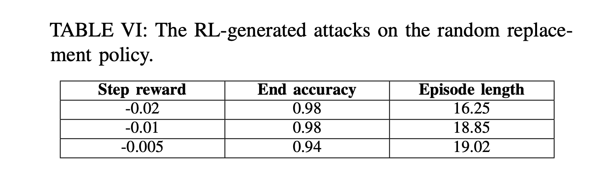

# Table VI: random replacement policies


We compare the attack patterns found in Table VI and epochs need for different rewards used in random replacement policies.




First, go to the directory.

```
cd ${GIT_ROOT}/src/rlmeta
```

(Optional) To train a config in Table VI, use the following script:

```
$ python train_ppo_attack.py env_config=<NAME_OF_THE_CONFIG>
```

which will print out the following:

```
/home/ml2558/miniconda3/envs/rllib/lib/python3.9/site-packages/hydra/_internal/defaults_list.py:251: UserWarning: In 'ppo_attack': Defaults list is missing `_self_`. See https://hydra.cc/docs/upgrades/1.0_to_1.1/default_composition_order for more information
 warnings.warn(msg, UserWarning)
workding_dir = /home/ml2558/Downloads/AutoCAT/src/rlmeta/outputs/2022-10-31/19-06-02
...
```
Please take notes of the ```working_dir```, which is the place where all the checkpoint and logs corresponding to this training is saved.

There are 17 configs in Table V, and we have  ```hpca_ae_exp_6_0005```, ```hpca_ae_exp_6_001```, ```hpca_ae_exp_002``` correpondingly, replace ```<NAME_OF_THE_CONFIG>``` with these.

Use ```Ctrl+C``` to interrupt the training, which will save a checkpoint in the given path ```src/rlmeta/output/<DATE>/<TIME>/ppo_agent-<X>.pth``` and corresponding training logs in ```src/rlmeta/output/<DATE>/<TIME>/train_ppo_attack.log```. 

We only need to look at the ```train_ppo_attack.log``` to figure out the end accuracy and episode length.

Since the training takes some time, we provide pretrained checkpoints in the following directory ```src/rlmeta/data/table6```. For each folder, we include the ```ppo_agent-X.pth``` which is the last checkpoint in the training processes, we also include the training logs.


Use the following to grep the interested information from ```train_ppo_attack.log```

```
$ cat train_ppo_attack.log |grep Eval | awk '{print  $4 $5 $6 $7 $8 $9 $10 $11 $12 $13 $14 $15 $16 $56 $57 $58 $59 $60 $61 $62 $63 $64 $65 $66 $67 $68 $69 $70 $71 $72} | tail -1'
```

which will print out the mean/max/min of ```episode_length```, ```correct_rate``` for the last epoch.

For example,

```
 $ cat hpca_ae_exp_6_001/train_ppo_attack.log |grep Eval | awk '{print  $4 $5 $6 $7 $8 $9 $10 $11 $12 $13 $14 $15 $16 $56 $57 $58 $59 $60 $61 $62 $63 $64 $65 $66 $67 $68 $69 $70 $71 $72}'| tail -1
```

will print out the case when the ```step_reward``` is -0.01.

```
{"episode_length":{"mean":19.020000000000017,"std":13.37757825617178,"min":7.0,"max":60.0,"count":100,"key":"episode_length"},"correct_rate":{"mean":0.9399999999999998,"std":0.23748684174075835,"min":0.0,"max":1.0,"count":100,"key":"correct_rate"},"info":"EEpoch79",
```
This means at the end episode (Episode 79), the ```episode_length``` is 19.02 and ```correct_rate``` is 0.94.  
For the cases when ```step_reward``` is -0.02 and -0.005 in Table VI, the ```episode_length``` and ```correct_rate``` can be extracted similarly.


