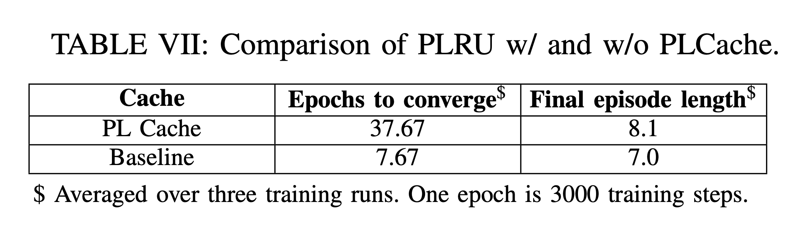

# Table VII: comparison of PLRU with and without PLCache

We compare the attack patterns found in Table VII and epochs need for PL cache and normal PLRU cache.




First, go to the directory.

```
cd ${GIT_ROOT}/src/rlmeta
```

(Optional) To train a config in Table VII, use the following script:

```
$ python train_ppo_attack.py env_config=<NAME_OF_THE_CONFIG>
```

There are 17 configs in Table VII, and we have ```hpca_ae_exp_7_baseline```, ```hpca_ae_exp_7_pl``` correpondingly, replace ```<NAME_OF_THE_CONFIG>``` with these.

Use ```Ctrl+C``` to interrupt the training, which will save a checkpoint in the given path.

Since the training takes some time, we provide pretrained checkpoints in the following directory ```src/rlmeta/data/table7```. For each folder, we include the ```ppo_agent-X.pth``` which is the last checkpoint in the training processes, we also include the training logs.


Use the following to grep the interested information from ```train_ppo_attack.log```

```
$ cat train_ppo_attack.log |grep Eval | awk '{print  $4 $5 $6 $7 $8 $9 $10 $11 $12 $13 $14 $15 $16 $56 $57 $58 $59 $60 $61 $62 $63 $64 $65 $66 $67 $68 $69 $70 $71 $72} '
```

which will print out the mean/max/min of ```episode_length```, ```correct_rate``` for the each epoch.

For example,

```
$ cat hpca_ae_exp_7_baseline/exp_1/train_ppo_attack.log |grep Eval | awk '{print  $4 $5 $6 $7 $8 $9 $10 $11 $12 $13 $14 $15 $16 $56 $57 $58 $59 $60 $61 $62 $63 $64 $65 $66 $67 $68 $69 $70 $71 $72}'
```
will print out the following

```
{"episode_length":{"mean":5.0,"std":0.0,"min":5.0,"max":5.0,"count":100,"key":"episode_length"},"correct_rate":{"mean":0.43000000000000005,"std":0.4950757517794625,"min":0.0,"max":1.0,"count":100,"key":"correct_rate"},"info":"EEpoch0",
{"episode_length":{"mean":2.0,"std":0.0,"min":2.0,"max":2.0,"count":100,"key":"episode_length"},"correct_rate":{"mean":0.52,"std":0.49959983987187184,"min":0.0,"max":1.0,"count":100,"key":"correct_rate"},"info":"EEpoch1",
{"episode_length":{"mean":2.0,"std":0.0,"min":2.0,"max":2.0,"count":100,"key":"episode_length"},"correct_rate":{"mean":0.46,"std":0.4983974317750846,"min":0.0,"max":1.0,"count":100,"key":"correct_rate"},"info":"EEpoch2",
{"episode_length":{"mean":2.0,"std":0.0,"min":2.0,"max":2.0,"count":100,"key":"episode_length"},"correct_rate":{"mean":0.5499999999999998,"std":0.49749371855331,"min":0.0,"max":1.0,"count":100,"key":"correct_rate"},"info":"EEpoch3",
{"episode_length":{"mean":2.0,"std":0.0,"min":2.0,"max":2.0,"count":100,"key":"episode_length"},"correct_rate":{"mean":0.5599999999999995,"std":0.4963869458396343,"min":0.0,"max":1.0,"count":100,"key":"correct_rate"},"info":"EEpoch4",
{"episode_length":{"mean":2.0,"std":0.0,"min":2.0,"max":2.0,"count":100,"key":"episode_length"},"correct_rate":{"mean":0.4700000000000001,"std":0.49909918853871127,"min":0.0,"max":1.0,"count":100,"key":"correct_rate"},"info":"EEpoch5",
{"episode_length":{"mean":2.0,"std":0.0,"min":2.0,"max":2.0,"count":100,"key":"episode_length"},"correct_rate":{"mean":0.47000000000000003,"std":0.49909918853871127,"min":0.0,"max":1.0,"count":100,"key":"correct_rate"},"info":"EEpoch6",
{"episode_length":{"mean":2.0,"std":0.0,"min":2.0,"max":2.0,"count":100,"key":"episode_length"},"correct_rate":{"mean":0.4299999999999999,"std":0.4950757517794625,"min":0.0,"max":1.0,"count":100,"key":"correct_rate"},"info":"EEpoch7",
{"episode_length":{"mean":2.0,"std":0.0,"min":2.0,"max":2.0,"count":100,"key":"episode_length"},"correct_rate":{"mean":0.47,"std":0.4990991885387114,"min":0.0,"max":1.0,"count":100,"key":"correct_rate"},"info":"EEpoch8",
{"episode_length":{"mean":2.0,"std":0.0,"min":2.0,"max":2.0,"count":100,"key":"episode_length"},"correct_rate":{"mean":0.5900000000000001,"std":0.49183330509431744,"min":0.0,"max":1.0,"count":100,"key":"correct_rate"},"info":"EEpoch9",
{"episode_length":{"mean":2.0,"std":0.0,"min":2.0,"max":2.0,"count":100,"key":"episode_length"},"correct_rate":{"mean":0.49999999999999983,"std":0.5,"min":0.0,"max":1.0,"count":100,"key":"correct_rate"},"info":"EEpoch10",
{"episode_length":{"mean":2.0,"std":0.0,"min":2.0,"max":2.0,"count":100,"key":"episode_length"},"correct_rate":{"mean":0.4800000000000001,"std":0.49959983987187195,"min":0.0,"max":1.0,"count":100,"key":"correct_rate"},"info":"EEpoch11",
{"episode_length":{"mean":2.0,"std":0.0,"min":2.0,"max":2.0,"count":100,"key":"episode_length"},"correct_rate":{"mean":0.48999999999999994,"std":0.49989998999799945,"min":0.0,"max":1.0,"count":100,"key":"correct_rate"},"info":"EEpoch12",
{"episode_length":{"mean":7.0,"std":0.0,"min":7.0,"max":7.0,"count":100,"key":"episode_length"},"correct_rate":{"mean":1.0,"std":0.0,"min":1.0,"max":1.0,"count":100,"key":"correct_rate"},"info":"EEpoch13",
{"episode_length":{"mean":7.0,"std":0.0,"min":7.0,"max":7.0,"count":100,"key":"episode_length"},"correct_rate":{"mean":1.0,"std":0.0,"min":1.0,"max":1.0,"count":100,"key":"correct_rate"},"info":"EEpoch14",
{"episode_length":{"mean":7.0,"std":0.0,"min":7.0,"max":7.0,"count":100,"key":"episode_length"},"correct_rate":{"mean":1.0,"std":0.0,"min":1.0,"max":1.0,"count":100,"key":"correct_rate"},"info":"EEpoch15",
{"episode_length":{"mean":7.0,"std":0.0,"min":7.0,"max":7.0,"count":100,"key":"episode_length"},"correct_rate":{"mean":1.0,"std":0.0,"min":1.0,"max":1.0,"count":100,"key":"correct_rate"},"info":"EEpoch16",
{"episode_length":{"mean":7.0,"std":0.0,"min":7.0,"max":7.0,"count":100,"key":"episode_length"},"correct_rate":{"mean":1.0,"std":0.0,"min":1.0,"max":1.0,"count":100,"key":"correct_rate"},"info":"EEpoch17",
{"episode_length":{"mean":7.0,"std":0.0,"min":7.0,"max":7.0,"count":100,"key":"episode_length"},"correct_rate":{"mean":1.0,"std":0.0,"min":1.0,"max":1.0,"count":100,"key":"correct_rate"},"info":"EEpoch18",
{"episode_length":{"mean":7.0,"std":0.0,"min":7.0,"max":7.0,"count":100,"key":"episode_length"},"correct_rate":{"mean":1.0,"std":0.0,"min":1.0,"max":1.0,"count":100,"key":"correct_rate"},"info":"EEpoch19",
```

You can see that at epoch **13** the ```correct_rate``` jump to 1.0 in this case, whose corresponding ```episode_length``` is 7.0. For baseline and PLcache, we perform three experiments each and calculate the corresponding average epoch to converge and episode_length at the end.
