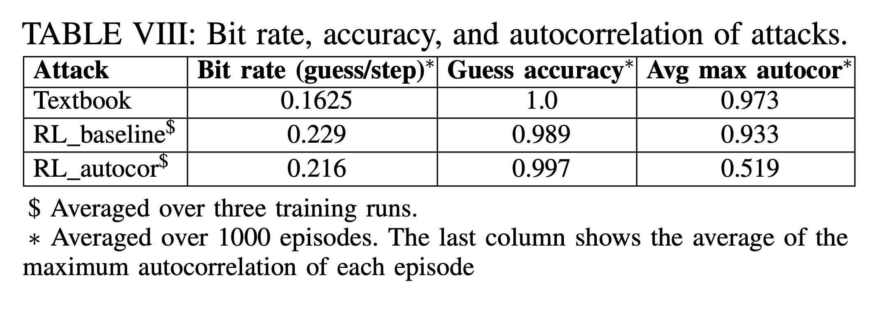

# Table VIII: bit rate, autocorrection and accuracy for attacks bypassing CChunter

We compare the attack patterns found in Table VIII and epochs need for different replacement policies.




First, go to the directory.

```
cd ${GIT_ROOT}/src/rlmeta
```

(Optional) To train a config in Table VIII, use the following script:

```
$ python train_ppo_cchunter.py train_device="cuda:0" infer_device="cuda:1" num_train_rollouts=48 num_train_workers=24 num_eval_rollouts=4 num_eval_workers=2 env_config=<NAME_OF_THE_CONFIG>
```

There are 3 configs (only two need training) in Table VIII, and we have ```hpca_ae_exp_8_autocor```, ```hpca_ae_exp_8_baseline``` correpondingly, replace ```<NAME_OF_THE_CONFIG>``` with these.

Use ```Ctrl+C``` to interrupt the training, which will save a checkpoint in the given path ```src/rlmeta/outputs/<DATE>/<TIME>/```.

To calculate the bit rate, max autocorrelation and accuracy of these scenarios, use the following.(replace ```<NAME_OF_THE_CONFIG>``` and ```<ABSOLUTE_PATH_TO_CHECKPOINT>```) correspondingly.

```
$ python sample_cchunter.py  env_config=<NAME_OF_THE_CONFIG> checkpoint=<ABSOLUTE_PATH_TO_CHECKPOINT> env_config.window_size=164 num_episodes=1000
```

Since the training takes some time, we provide pretrained checkpoints in the following directory ```src/rlmeta/data/table8/```.


To calculate the bit rate, max autocorrelation and accuracy of RL\_autocor 
```
$ python sample_cchunter.py env_config=hpca_ae_exp_8_autocor checkpoint=${GIT_ROOT}/src/rlmeta/data/table8/hpca_ae_exp_8_autocor_new/exp1/ppo_agent-499.pth num_episodes=1000
```

which printout the following in the end
```
  info                   key          mean         std           min           max    count
------  --------------------  ------------  ----------  ------------  ------------  -------
sample        episode_length  160.00000000  0.00000000  160.00000000  160.00000000     1000
sample        episode_return   24.87361181  4.42775145    5.26269423   33.31955257     1000
sample             num_guess   33.86500000  1.19948947   31.00000000   38.00000000     1000
sample           num_correct   33.79000000  1.18823398   31.00000000   37.00000000     1000
sample          correct_rate    0.99784251  0.00968676    0.91666667    1.00000000     1000
sample              bandwith    0.21165625  0.00749681    0.19375000    0.23750000     1000
sample          max_autocorr    0.52178425  0.12436690    0.22448980    0.87297078     1000
sample      detect_rate-0.75    0.03400000  0.18122914    0.00000000    1.00000000     1000
sample  overall_correct_rate    0.99778532  0.00000000    0.99778532    0.99778532        1
sample      overall_bandwith    0.21165625  0.00000000    0.21165625    0.21165625        1

```
The bit rate(overall_bandwidth)=0.212, correct_rate=0.998, and average max_autocorr=0.522 can be read out directly.

Similarly, to calculate the bit rate, max autocorrelation and accuracy of RL\_baseline
```
$ python sample_cchunter.py env_config=hpca_ae_exp_8_baseline checkpoint=${GIT_ROOT}/src/rlmeta/data/table8/hpca_ae_exp_8_baseline_new/exp1/ppo_agent-499.pth num_episodes=1000
```

To calculate the bit rate, max autocorrelation and accuracy of textbook attacker

```
$ python sample_cchunter_textbook.py 
```
