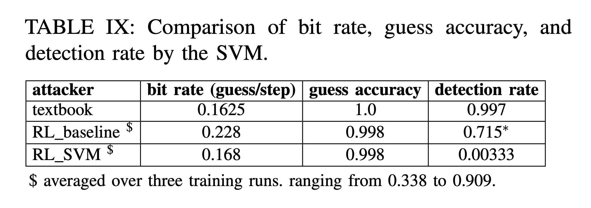

# Table IX: bit rate, guess accuarcy and detection rate for attacks bypassing SVM-based detector

We compare bit rate, guess accuarcy and detection rate for attacks found in Table IX




First, go to the directory.

```
cd ${GIT_ROOT}/src/rlmeta
```
(Optional) To train a config in Table IX, use the following script:

```
$ python train_ppo_cyclone.py train_device="cuda:0" infer_device="cuda:1" num_train_rollouts=48 num_train_workers=24 num_eval_rollouts=4 num_eval_workers=2 env_config=<NAME_OF_THE_CONFIG>
```

There are 3 configs (only two need training) in Table IX, and we have ```hpca_ae_exp_9_baseline```, ```hpca_ae_exp_9_svm``` correpondingly, replace ```<NAME_OF_THE_CONFIG>``` with these.

Use ```Ctrl+C``` to interrupt the training, which will save a checkpoint in the given path ```src/rlmeta/outputs/<DATE>/<TIME>/```..

To calculate the bit rate, max autocorrelation and accuracy of these scenarios, use the following.(replace ```<NAME_OF_THE_CONFIG>``` and ```<ABSOLUTE_PATH_TO_CHECKPOINT>```) correspondingly.

```
$ python sample_cyclone.py  env_config=<NAME_OF_THE_CONFIG> checkpoint=<ABSOLUTE_PATH_TO_CHECKPOINT> env_config.window_size=164 num_episodes=1000
```

Since the training takes some time, we provide pretrained checkpoints in the following directory ```src/rlmeta/data/table9/```.


To calculate the bit rate, max autocorrelation and accuracy of RL\_baseline
```
$  python sample_cyclone.py checkpoint=${GIT_ROOT}/AutoCAT/src/rlmeta/data/table9/hpca_ae_exp_9_baseline/ppo_agent-70.pth env_config.window_size=164 num_episodes=1000
```

which printout the following in the end
```
 info                   key          mean         std           min           max    count
------  --------------------  ------------  ----------  ------------  ------------  -------
sample        episode_length  161.36200000  0.80433575  160.00000000  162.00000000     1000
sample        episode_return   33.67600000  1.95730018   26.00000000   40.00000000     1000
sample             num_guess   35.13600000  1.44965651   31.00000000   40.00000000     1000
sample           num_correct   34.74200000  1.46745903   31.00000000   40.00000000     1000
sample          correct_rate    0.98893407  0.01903875    0.88571429    1.00000000     1000
sample              bandwith    0.21774389  0.00885451    0.19135802    0.24844720     1000
sample        cyclone_attack    0.67200000  0.46948482    0.00000000    1.00000000     1000
sample  overall_correct_rate    0.98878643  0.00000000    0.98878643    0.98878643        1
sample      overall_bandwith    0.21774643  0.00000000    0.21774643    0.21774643        1
```
The bit rate(overall_bandwidth)=0.22, correct_rate=0.989, and detection_rate (cyclone_attack)=0.672 can be read out directly.

Similarly, to calculate the bit rate, max autocorrelation and accuracy of RL\_SVM
```
$ python sample_cyclone.py checkpoint=${GIT_ROOT}AutoCAT/src/rlmeta/data/table9/hpca_ae_exp_9_svm/ppo_agent-70.pth env_config.window_size=164 num_episodes=1000
```

To calculate the bit rate, max autocorrelation and accuracy of textbook attacker

```
$ python sample_cyclone_textbook.py 
```
